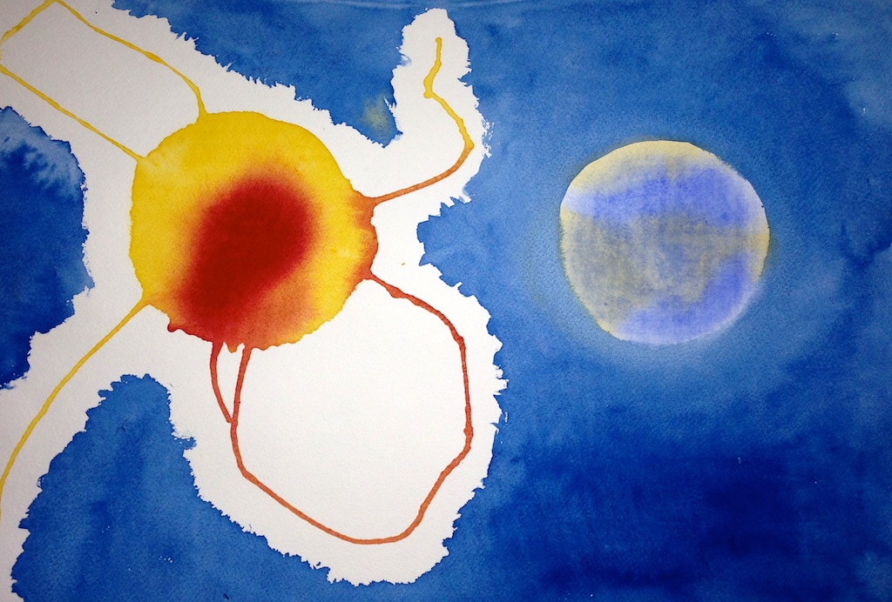

# Uncle Harold Teaches God about Control Structures

Long before the Earth and Sun and Moon existed as we know them today, when God was just a little boy, he was sitting in deity school struggling with his Intro to Programming the Universe homework.  It was this whole concept of "time" — days, weeks, months, years, etc.  What the heck were they?  How were they related?  And how was he ever going to make a beautiful planetary home for his imaginary human friends?

"I know," thought God.  "I'll ask Uncle Harold.  He knows everything."  Harold was God's great uncle, who had been making worlds for ages now.  So after classes ended, God stopped by Harold's house.

"Hi there, little God," said Harold.  "How nice to see you!  What can I help you with?"

"Uncle Hal, I need some help with my homework.  Our teacher has asked us to create a world for our imaginary friends.  Somehow we need to make a planet that travels around a star, and the inhabitants of the world need a way to keep track of time."

"Ah, of course.  Seconds, minutes, days, weeks, months, years, right?"

"Well, for this first assignment we only need to give them days, weeks, months, and years."

"Ok, simple enough. Let's get to it!"  Harold had designed hundreds of worlds, and new just where to start.

"First, we need a planet.  What should we call it?"

"Earth!  And I want it to be blue and green."

"Ok.  So we'll start by creating a new Planet called earth, and setting its colors to blue and green."

```javascript
	earth = new Planet();
	earth.setColors("blue", "green");
```

"And then we'll need a star," said Harold.

"Oh yeah.  Let's call it Sun.  And it should be yellow, and really bright!"

```javascript
sun = new Star();
sun.setColors("yellow");
sun.setBrightness(REALLY_BRIGHT);
```

"Now," said Harold, "in order for our human friends to experience time, their planet needs to be moving though space.  I won't go into the details, but suffice it to say that space and time are intimately related.  The general idea is this: the planet moves in a big circle around the star, all the while spinning around and around on its own axis.  We say the planet 'revolves' around the star, and that it 'rotates' about its axis.  Kapish?"

"Sure... so where do days come in?"

"Well, a day is just what we call it when the planet has rotated one time.  So we can create a function for rotating the earth once, and call it "day."

```
function day() {
	earth.rotateOnce();
}
```

"Ok, that makes sense.  Now what about weeks?"  

"A week is just a group of days," said Harold.  "How many days would you like earth's week to be?"

"Seven!" cried little God, without hesitation.

"Seven!?  That's a funny choice!  But so be it — seven days to the week for earthlings.  So how would we write that?"

"That's easy," said God, "we'll just use the day function seven times in a row."  He immediately started scribbling.

```
function week() {
	// 1
	day();
	// 2
	day();
	// 3
	day();
	// 4
	day();
	// 5
	day();
	// 6
	day();
	// 7
	day();
}
```

"Ok," said Uncle Harold, nodding.  "That's one way to do it.  But there's a another way that will save us some paper, and will let us easily change the length of the week later on, if we decide seven is too odd a number.  How would you describe to someone else the week function you just wrote?"

"Well, I guess I'd say, 'Count from one to seven, and for every number make one day happen.'"

"Exactly right.  And you could rephrase that slightly to say, 'For every number from one to seven, call the day() function.'"

"Sure, that's the same."

"Alright.  Well, lucky for us, there is something called a 'for loop' that does  precisely this!  We just tell it what number to start with, when to stop, and by what increment it should count, and then we tell it what to do each time it counts the next number.  For our week, it would look like this:"

for (count = 1; count <= 7;  count += 1) {
	day();
}

"Here we've said, 'Start at 1.  Keep counting until count is no longer less than or equal to seven.  Count up by one at a time.  And for every number you count, call the day method.'  That's it!"

"Ok, I think I understand.  So if I decide tomorrow morning that I want each week to have 19 days instead of seven, I can just change that seven to a 19?"

"Sure — whatever number the little master of the Universe wishes."

"Wow, that really is a much better way!  So I think I can figure out the month by myself.  Let's see.  I want 15 mo..."

"Let me stop you right there," Uncle Hal interjected.  "I think you'll find 12 months will make for a better year."

"Twelve months?  Why 12?"

"Trust me on this one."

"Ah... ok.  So 12 months.  But wait... how do I know how many days should go into a month?"

"Good question!  The key is first to decide how many days you want in each year.  What do you think?"

"How about 365?"

"Ok, that will make things a little difficult, 


